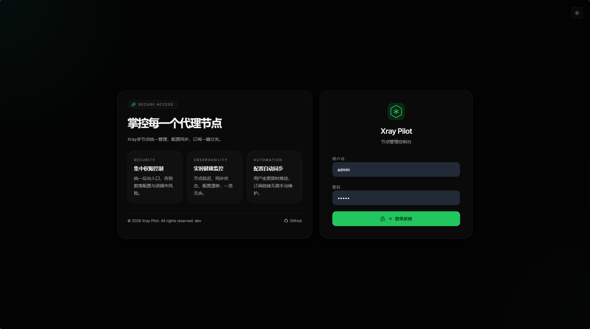
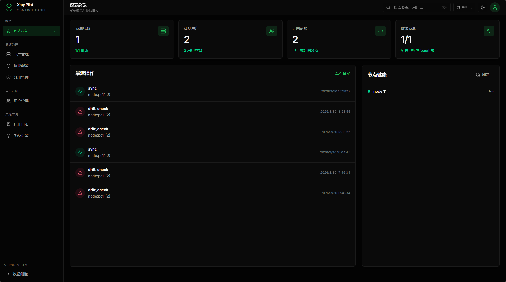
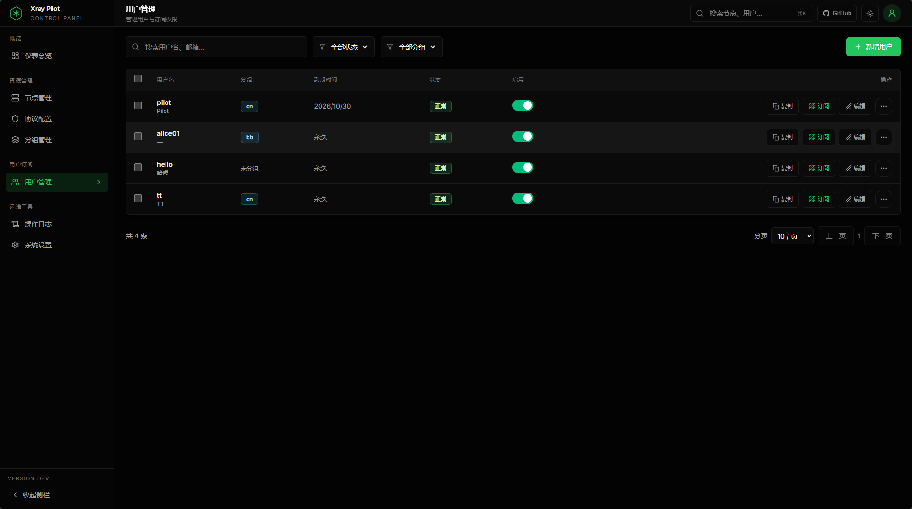
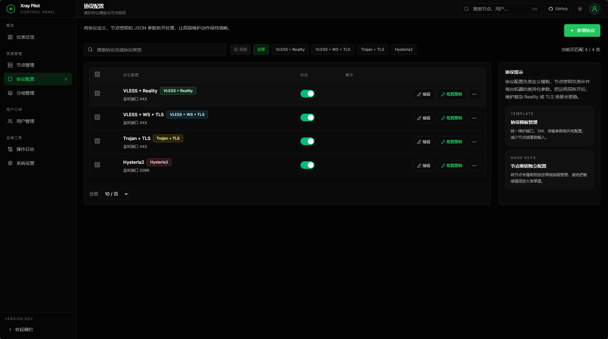
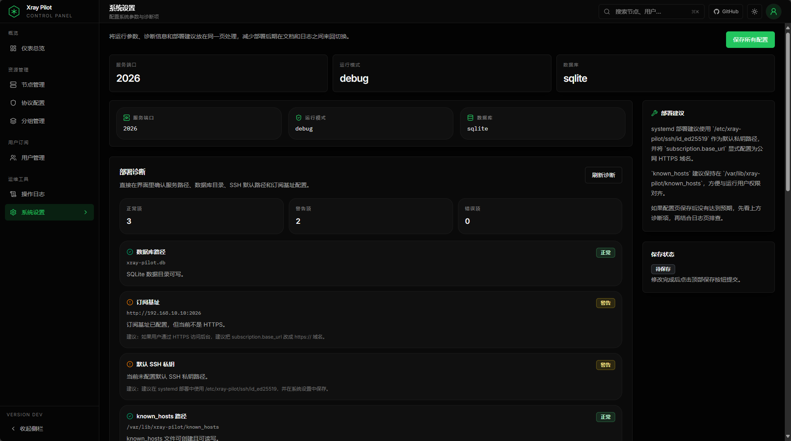
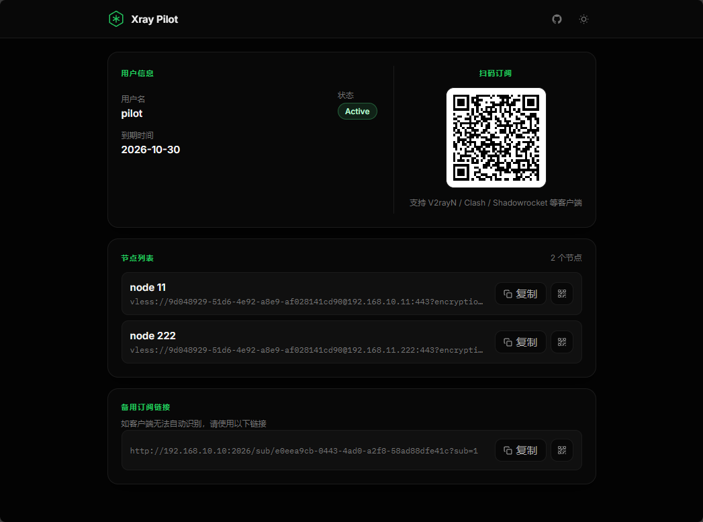

# xray-pilot

面向小团队的自托管 Xray 管理面板。它可以通过 SSH 下发配置、检测配置漂移，并用单个嵌入前端的 Go 二进制提供完整管理界面。

[English README](./README.md)

## 功能特性

- 管理 Xray Reality 节点的创建、编辑、同步与启停
- 定时执行配置漂移检测，基于 SHA256 比较本地与远端配置
- 管理用户、分组与订阅访问权限
- 生成多格式订阅，并根据节点健康状态优先选择可用节点
- 通过 SSH 原子上传配置并重启远端服务
- 使用 `go:embed` 打包前端，部署时只需要一个后端二进制
- 运行时系统配置写入数据库，可直接在 Web UI 中调整

## 界面截图

建议将截图放在 [`docs/screenshots/`](./docs/screenshots/) 目录，并使用以下命名格式：

- `01-login.png`
- `02-dashboard.png`
- `03-users.png`
- `04-profiles.png`
- `05-settings.png`
- `06-subscribe.png`

推荐截图顺序：

1. 登录页
2. 仪表盘
3. 用户管理
4. 协议配置
5. 系统设置
6. 订阅页

> 当前后台界面以中文为主，保留英文 `README.md` 更有利于 GitHub 展示与项目传播；中文细节可以通过本页和截图补充说明。

### 登录页



展示控制台登录入口、主题切换、GitHub 链接与产品品牌信息，适合作为项目第一印象。

### 仪表盘



集中展示节点健康、活跃用户、订阅分发和最近操作，方便快速判断控制平面当前状态。

### 用户管理



支持创建和维护订阅用户、复制订阅链接、查看二维码、控制到期时间，并通过统一交互完成启用或禁用。

### 协议配置



将协议模板与节点密钥拆分管理，方便维护共享参数与节点差异配置，降低 Reality/TLS 场景的维护复杂度。

### 系统设置



可直接查看运行诊断、部署建议和数据库中的运行时设置，减少手动修改配置文件的频率。

### 订阅页



同一个 `/sub/{token}` 入口可以根据访问场景返回浏览器信息页或客户端订阅内容，并在页面中提供二维码导入、节点级复制和备用链接等操作。

## 技术栈

| 层 | 技术 |
| --- | --- |
| 后端 | Go 1.26.1+、Gin、GORM、Zap |
| 数据库 | 默认 SQLite，可选 PostgreSQL |
| 鉴权 | JWT Bearer Token、bcrypt |
| 加密 | AES-GCM 存储敏感字段，SHA256 做漂移校验 |
| 前端 | React 19、Vite、TypeScript、Tailwind CSS v4 |

## 安装

### 一键安装

Linux `amd64` 和 `arm64` 机器可以直接执行：

```bash
curl -fsSL https://raw.githubusercontent.com/imrui/xray-pilot/main/install.sh | sudo bash
```

安装脚本会自动完成：

- 检测系统架构
- 下载最新 GitHub Release
- 校验 `checksums.txt`
- 将二进制安装到 `/usr/local/bin/xray-pilot`
- 生成 `/etc/xray-pilot/config.yaml`
- 创建 `/etc/xray-pilot/ssh/` 目录用于存放服务读取的 SSH 私钥
- 创建并启动 `xray-pilot.service`
- 生成随机管理员密码、`jwt.secret` 和 `crypto.master_key`

### 手动安装

| 平台 | 压缩包 |
| --- | --- |
| Linux amd64 | `xray-pilot_<version>_linux_amd64.tar.gz` |
| Linux arm64 | `xray-pilot_<version>_linux_arm64.tar.gz` |
| macOS amd64 | `xray-pilot_<version>_darwin_amd64.tar.gz` |
| macOS arm64 | `xray-pilot_<version>_darwin_arm64.tar.gz` |

手动安装步骤：

1. 从最新的 [GitHub Release](https://github.com/imrui/xray-pilot/releases) 下载对应平台压缩包和 `checksums.txt`。
2. 使用 `sha256sum -c checksums.txt --ignore-missing` 校验文件。
3. 解压后将二进制放到目标路径。
4. 将 [`config.yaml.example`](./config.yaml.example) 复制为 `config.yaml` 并修改配置。
5. 执行 `./xray-pilot` 启动服务。

### 节点初始化

对于新节点，可以使用仓库内的 [`scripts/node-bootstrap.sh`](./scripts/node-bootstrap.sh) 快速完成基础准备。脚本会依次执行：

- 调整 `sshd_config` 中的全局 `PermitRootLogin`
- 可选写入 root 的 `authorized_keys`
- 安装并重启 `xray`
- 可选开启 `BBR`
- 最后尝试重启 SSH 服务

推荐流程：

1. 切换到 `root` 用户执行脚本。
2. 按提示粘贴用于管理节点的 SSH 公钥；直接回车可跳过这一步。
3. 脚本结束后确认输出中的 `Xray version` 和 `TCP congestion control`。

推荐直接执行：

示例：

```bash
curl -fsSL https://raw.githubusercontent.com/imrui/xray-pilot/main/scripts/node-bootstrap.sh | sudo bash
```

如果你希望非交互执行，也可以在运行前传入 `AUTHORIZED_KEYS`：

```bash
curl -fsSL https://raw.githubusercontent.com/imrui/xray-pilot/main/scripts/node-bootstrap.sh | \
sudo AUTHORIZED_KEYS=$'ssh-ed25519 AAAA... admin@main\nssh-ed25519 AAAA... root@main' bash
```

如果你更习惯先下载再执行，也可以：

```bash
curl -fsSL https://raw.githubusercontent.com/imrui/xray-pilot/main/scripts/node-bootstrap.sh -o /root/node-bootstrap.sh
chmod +x /root/node-bootstrap.sh
bash /root/node-bootstrap.sh
```

注意事项：

- 如果你跳过公钥输入，脚本不会中断，但会提示你手动检查 `/root/.ssh/authorized_keys`。
- 脚本会尽量只修改 `sshd_config` 全局段里的 `PermitRootLogin`，不会主动改动 `Match` 块。
- 脚本修改前会自动备份 `sshd_config`，备份文件名类似 `/etc/ssh/sshd_config.bak.20260401-221500`。
- 部分发行版的 SSH 服务名可能不同，脚本会自动尝试 `ssh` 和 `sshd`；如果都失败，会输出提醒，需手工重启。
- 建议在云厂商安全组、防火墙和系统防火墙中同时确认 `22` 端口可访问。

## 升级

已经通过一键安装部署的 Linux 机器，可以直接重新执行安装脚本完成升级：

```bash
curl -fsSL https://raw.githubusercontent.com/imrui/xray-pilot/main/install.sh | sudo bash
```

升级过程会：

- 用最新 Release 二进制替换 `/usr/local/bin/xray-pilot`
- 保留现有 `/etc/xray-pilot/config.yaml`
- 保留现有 `/etc/xray-pilot/ssh/` 密钥目录
- 保留现有 SQLite 数据库或外部数据库配置
- 重新加载并重启 `xray-pilot.service`

升级后可以通过下面的命令确认当前运行版本：

```bash
journalctl -u xray-pilot -n 20 --no-pager
```

## 从源码启动

前置要求：Go 1.26.1+、Node.js 24+

```bash
git clone https://github.com/imrui/xray-pilot.git
cd xray-pilot

make build

cp config.yaml.example config.yaml
# 生产环境请先修改 jwt.secret 和 crypto.master_key

./xray-pilot
```

启动后访问 `http://localhost:2026`，使用 `config.yaml` 中配置的管理员账号登录。

## 配置说明

将 [`config.yaml.example`](./config.yaml.example) 复制为 `config.yaml`：

```yaml
server:
  port: 2026
  mode: release

database:
  driver: sqlite
  dsn: xray-pilot.db

jwt:
  secret: "change-me-use-a-long-random-string"
  expire: 24

crypto:
  master_key: ""

ssh:
  default_port: 22
  default_user: "root"
  default_key_path: ""
  known_hosts_path: "/var/lib/xray-pilot/known_hosts"

admins:
  - username: admin
    password: "change-me-now"
```

对于 Linux systemd 部署，推荐将 SSH 私钥放在 `/etc/xray-pilot/ssh/id_ed25519`，服务使用的 `known_hosts` 文件保存在 `/var/lib/xray-pilot/known_hosts`。

调度周期、SSH 默认值、订阅格式、Xray 日志等级等运行时配置，已经迁移到数据库中的系统配置表，可在 Web UI 里调整。

也可以通过环境变量覆盖主密钥：

```bash
XRAY_PILOT_MASTER_KEY=<hex-key> ./xray-pilot
```

优先级：

1. `XRAY_PILOT_MASTER_KEY`
2. `config.yaml -> crypto.master_key`
3. 首次启动自动生成

## 开发

```bash
# 后端
make dev-backend

# 前端
make dev-frontend
```

前端开发服务器会将 API 请求代理到 `http://localhost:2026`。

## 自动发布

推送形如 `v*` 的 tag 后，GitHub Actions 会自动：

1. 使用 Node 24 构建前端
2. 使用 Go 1.26 编译发布二进制
3. 打包 Linux 和 macOS 的 `amd64`、`arm64` 压缩包
4. 生成 `checksums.txt`
5. 创建并发布 GitHub Release

## 许可证

MIT，见 [LICENSE](./LICENSE)。
